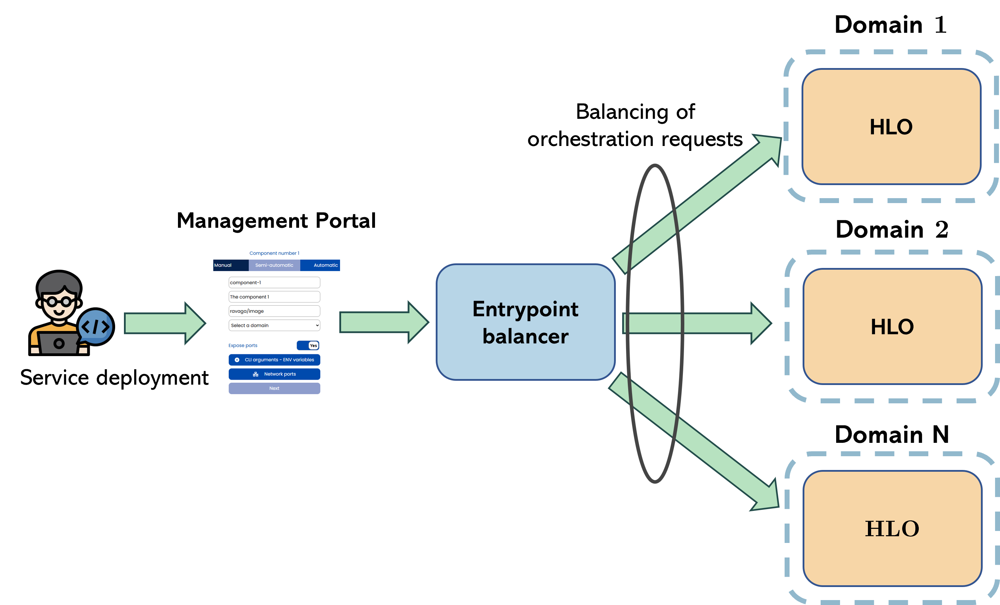

# Entrypoint Balancer

Backend of **Entrypoint Balancer**, which is a component that distributes the requests received
from [Management Portal](https://github.com/eclipse-aerios/management-portal-backend) between HLOs of different domains.


## Features
The Entrypoint balancer offers the endpoint *POST, PUT /entrypoint-balancer/distribute/{serviceId}*, which enables the Management Portal Backend to send the upcoming service (re)orchestration request that are to be distributed among the HLOs of the continuum domains. The endpoint accepts:

- Path variable *serviceId*, which is a unique identifier of the service that is to be deployed in one of the domains.
- YAML request body representing a valid TOSCA specification of the service.

Moreover, the Entrypoint balancer supports runtime updates of its internal configuration by exposing the *GET, POST /entrypoint-balancer/configure* endpoint. It accepts a JSON body with a valid configuration specification, about which more details can be found in Configuration options section.

```json
{
  "maxAssignments": 10,
  "weightingFunctionType": "RAM_AND_CPU"
}
```

## Load balancing algorithm

The algorithm implemented within Entrypoint balancer is based on the [Improved Weighted Least Connections](https://link.springer.com/chapter/10.1007/978-3-642-17625-8_13). It works in the following way. The Entrypoint balancer assign to each of the domains registered in the NGSI-LD context broker the flag **availability**, which indicates whether a given domain is going to be considered in the processing of next client request. Initially, all domains are marked as available. The information about the domains’ availability is stored in the Entrypoint balancer’s cache and is being updated in consecutive computations of the algorithm.

Whenever the client request is received, the Entrypoint balancer begins by evaluating the scores of each available domain using the **weighting function**. By default, the weighting function computes the CPU and RAM usage of all IEs belonging to the given domain. However, its code can be easily modified (e.g. to take into account different properties) depending on the high-level requirements. The domain’s score is obtained by dividing the number of services running within a domain (services with *Running* status) by the weight computed using weighting function. Then the domain, which has a highest score is selected by the algorithm.

```
Domain Weight = Σ(CPU usage + RAM usage of each node) / Number of nodes in the domain

Domain Score = Number of deployed components / Domain Weight
```

To prevent the cases in which a single domain would be consecutively selected by the algorithm (e.g. when it was newly added to the continuum), the Entrypoint balancer uses a parameter named **maxAssignments**. If a given domain is selected more than *maxAssignments* time, it is being temporarily blocked for the next maxAssignments - 1 selections (see [Improved Weighted Least Connections](https://link.springer.com/chapter/10.1007/978-3-642-17625-8_13)). After that, the domain is made, once again, available. This feature, is applicable only when there is more than 1 domain present in the continuum.

## Place in the aeriOS architecture

The Entrypoint balancer aims to relax the centralised needs of a unique, 1:1, direct relation Management Portal -> HLO, towards a 1:N, fairly distributed approach. In fact, with this addition, the existence of an Entrypoint balancer emphasises the decentralised nature of aeriOS orchestration. This way, regardless of the *Entrypoint domain* choice, the inception of orchestration (the HLO that will initiate the process) is balanced across domains.

<p align="center">
  
</p>


## Technological stack

1. Development stack: Spring Boot 3 + Spring Framework 6
2. Test stack: JUnit 5
3. Additional libraries such as OpenFeign

The prerequisites for local development include: 
1. [JDK 21](https://www.oracle.com/es/java/technologies/downloads/#java21)
2. [Maven 3.8](https://maven.apache.org/download.cgi)


## Configuration

The Spring application can be configured through the modification of the [application.yaml](src/main/resources/application.yaml) file:

```yaml
spring:
  cloud:
    openfeign:
      client:
        config:
          orion-ld:
            url: "http://orion-ld-broker:1026/ngsi-ld/v1/"
            connect-timeout: 20000
            read-timeout: 20000
            logger-level: basic
          hlo-fe:
            url: "http://hlo-fe-service:8081"
            connect-timeout: 10000
            read-timeout: 10000
            logger-level: basic
load-balancer:
  max-assignments: 10
  weighting-function: CPU
``

